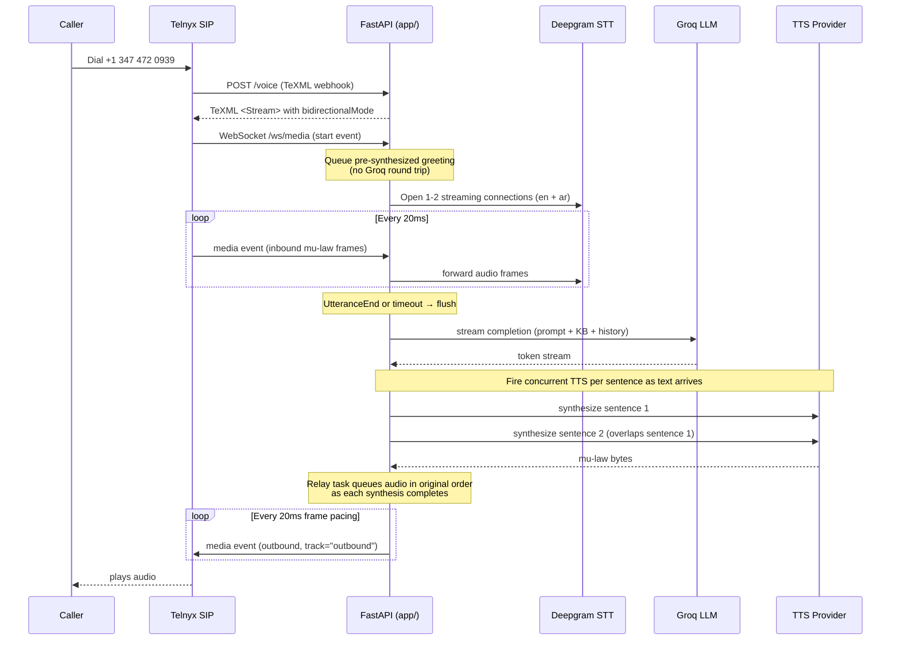
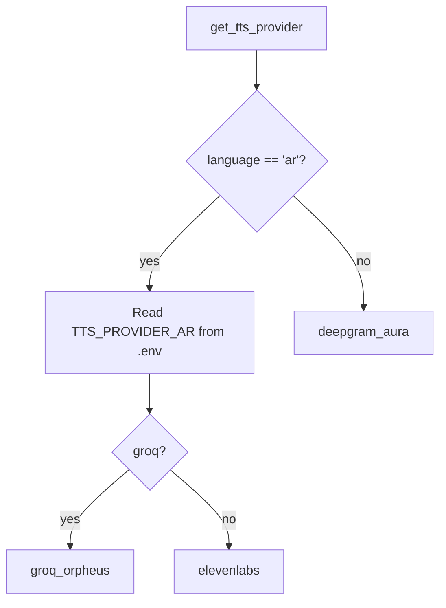
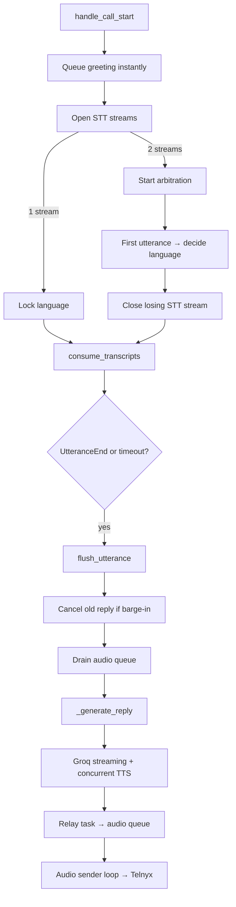
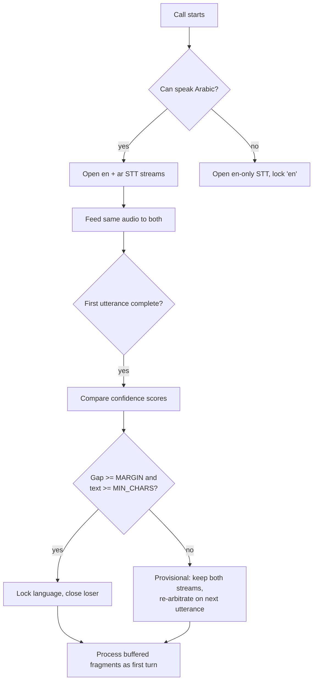
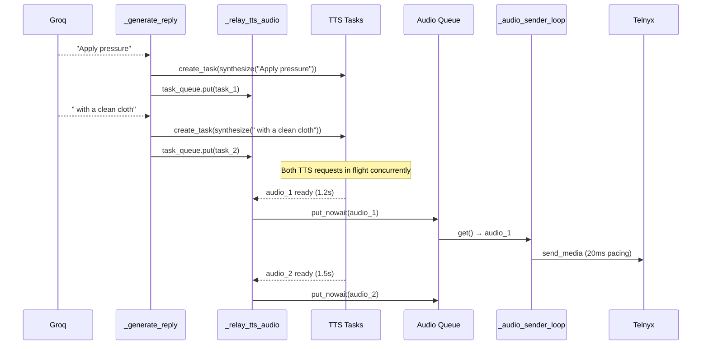
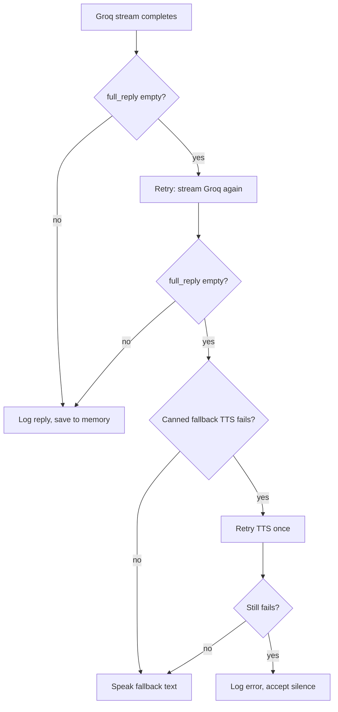

# Najda Voice — Multilingual AI First Aid Voice Call Agent

An end-to-end phone-based AI assistant that walks callers through first aid
emergencies in English or Arabic. Call a US number, speak naturally, and
Najda responds with step-by-step guidance matched to the situation.

**Live number:** `+1 347 472 0939`

---

## Architecture Overview



---

## Service Provider Decisions

| Service | Choice | Why not the alternative |
|---------|--------|------------------------|
| **Phone provider** | Telnyx | Twilio trial blocks non-US callers. Telnyx US number with no geographic restrictions. |
| **STT** | Deepgram Nova-3 | Industry-standard streaming STT with `UtteranceEnd` event and per-frame confidence scoring. |
| **LLM** | Groq `openai/gpt-oss-20b` | Fastest model on Groq (~963 tok/s, ~0.73s TTFT). Chosen over Llama 3.x (deprecated June 2026 by Groq) and Qwen (higher benchmarks but 8x cost and slower — for 30-50 token replies, speed wins). |
| **English TTS** | Deepgram Aura-2 Asteria | Lowest latency TTS we tested for English. Direct mu-law 8kHz output, no conversion step. |
| **Arabic TTS** | Groq Orpheus (`canopylabs/orpheus-arabic-saudi`) | ElevenLabs free tier rejects library voices via API (402 `paid_plan_required` live). Orpheus reuses the same GROQ_API_KEY — no extra account. |

---

## Project Structure

```
najda-voice/
├── config.py                   — Pydantic Settings from .env
├── run.py                      — uvicorn entrypoint
├── requirements.txt            — pip dependencies
├── Dockerfile                  — container image (python:3.14-slim)
├── docker-compose.yml          — EC2 deployment (with healthcheck)
├── .env.example                — all 17 config fields documented
│
├── app/
│   ├── main.py                 — FastAPI app factory, lifespan, prewarm
│   │
│   ├── models/
│   │   └── schemas.py          — CallSession, Turn, TranscriptChunk
│   │
│   ├── core/
│   │   ├── language.py         — TTS provider resolution, dialect codes
│   │   ├── memory.py           — conversation history + summarization
│   │   ├── logging_config.py   — centralized logging, quiet noisy libs
│   │   └── voice.py            — THE BRAIN: orchestrator (~850 lines)
│   │
│   ├── routes/
│   │   ├── voice.py            — TeXML webhook + WS media stream
│   │   └── telnyx_token.py     — WebRTC JWT for browser dialer
│   │
│   ├── services/
│   │   ├── deepgram_stt.py     — Streaming STT (keepalive, UtteranceEnd)
│   │   ├── deepgram_tts.py     — English TTS (Aura-2, rate-limited)
│   │   ├── elevenlabs_tts.py   — Arabic TTS fallback (Flash v2.5)
│   │   ├── groq_tts.py         — Arabic TTS (Orpheus, WAV→mu-law)
│   │   └── groq_llm.py         — LLM streaming (gpt-oss-20b)
│   │
│   └── prompts/
│       ├── system_en.txt       — English system prompt
│       ├── system_ar.txt       — Arabic system prompt
│       ├── prompt_builder.py   — Assembles system + KB + history
│       └── kb_loader.py        — YAML KB loader + scenario matching
│
├── knowledge/
│   ├── KB_Bleeding.yaml        — 8 first-aid scenarios
│   ├── KB_Burns.yaml
│   ├── KB_Choking.yaml
│   ├── KB_CPR.yaml
│   ├── KB_ElectricShock.yaml
│   ├── KB_Fractures.yaml
│   ├── KB_SnakeBites.yaml
│   └── KB_AllergicReactions.yaml
│
├── scripts/
│   ├── start.sh                — Docker Compose startup + health wait
│   ├── health_check.sh         — standalone /health check
│   ├── update_duckdns.sh       — DuckDNS IP update for EC2
│   └── test_arabic_tts.py      — auditions all 6 Orpheus voices
│
├── tests/
│   ├── test_local.py           — full local test suite (5 tests)
│   ├── test_contraction.py     — keyword matching with contractions
│   └── check_telnyx.py         — Telnyx API reachability check
│
└── voice_samples/              — Orpheus WAV + mu-law samples
```

---

## File-by-File Guide

### `config.py` — Configuration

Pydantic `BaseSettings` reading from `.env`. 17 fields total:

| Field | Default | Purpose |
|-------|---------|---------|
| `telnyx_api_key` | `""` | Telnyx API key (required) |
| `telnyx_phone_number` | `""` | Your Telnyx number |
| `telnyx_telephony_credential_id` | `""` | For browser WebRTC dialer |
| `deepgram_api_key` | `""` | Deepgram STT + TTS |
| `stt_language_ar` | `"ar"` | Arabic STT dialect (ar-EG, ar-SA, etc.) |
| `groq_api_key` | `""` | Groq LLM + Orpheus TTS |
| `tts_provider_ar` | `"groq"` | `"groq"` or `"elevenlabs"` |
| `groq_tts_voice_ar` | `"aisha"` | Orpheus voice name |
| `groq_tts_concurrency` | `1` | Concurrent TTS requests (keep 1 on free tier) |
| `elevenlabs_api_key` | `""` | ElevenLabs (if using as Arabic TTS) |
| `elevenlabs_voice_id_ar` | `""` | ElevenLabs voice ID for Arabic |
| `app_env` | `"development"` | Controls debug logging + uvicorn reload |
| `public_base_url` | `""` | Ngrok URL (required — used in TeXML) |

`ws_base_url()` converts `https://...` to `wss://...` for the WebSocket URL.
`validate_required()` is called at startup to catch missing keys early.

### `run.py` — Entrypoint

```python
uvicorn.run("app.main:create_app", factory=True, host="0.0.0.0", port=8000,
            reload=settings.app_env == "development")
```

`reload=True` in development so the server restarts on `.py` changes.

### `app/main.py` — FastAPI App Factory

- `setup_logging()` called at module level — runs before anything else logs.
- `lifespan` context manager:
  - Validates required config keys.
  - Checks Arabic TTS configuration; warns loudly if missing.
  - Pre-synthesizes greeting lines into `_greeting_audio_cache` so the first
    call doesn't pay a TTS round trip for a fixed string.
- Mounts two routers: `/voice` + `/ws/media` (Telnyx), `/telnyx-token` (WebRTC).
- `GET /health` — returns `{"status": "ok"}`.

### `app/models/schemas.py` — Data Models

- **`CallSession`**: `call_sid`, `stream_sid`, `language` (set once arbitration completes), `is_active`.
- **`Turn`**: `role` ("user"|"assistant"), `content` — used for memory/history.
- **`TranscriptChunk`**, **`MediaPayload`**, **`StreamStartPayload`**: Pydantic models
  matching the Telnyx WebSocket JSON envelope. (Mostly unused now — raw dict access
  in routes/voice.py is simpler for the one-off parsing we do.)

### `app/core/logging_config.py` — Logging Setup

Silences these noisy libraries so our logs aren't buried:

- `httpx` → WARNING (chatty HTTP debug)
- `httpcore` → WARNING
- `uvicorn.access` → WARNING (every request line)
- `websockets.client` → WARNING (binary frame dumps)
- `websockets.server` → WARNING

Root logger is set to DEBUG in development, INFO in production. All output
goes to stdout with timestamps.

### `app/core/language.py` — Language Detection and Routing



Key behaviors:

- **Arabic TTS is resolved dynamically** at runtime from `settings.tts_provider_ar`,
  not hardcoded. This lets you switch providers without touching code.
- **`detect_language()`** maps Deepgram's language code (e.g. `ar-SA`, `en-US`) to
  our logical `"en"` / `"ar"`. Used by the old single-stream path (now mostly legacy
  — dual-stream arbitration in `voice.py` handles detection directly via confidence scoring).
- **`ARABIC_DIALECT_CODES`** — 17 verified Nova-3 Arabic dialect codes
  (ar, ar-AE, ar-SA, ar-QA, ar-KW, ar-SY, ar-LB, ar-PS, ar-JO, ar-EG, ar-SD,
  ar-MA, ar-DZ, ar-TN, ar-IQ, ar-TD, ar-IR). Set `STT_LANGUAGE_AR=ar-EG` to
  bias toward Egyptian Arabic, etc.

### `app/core/memory.py` — Conversation History

In-memory `dict[CallSid, list[Turn]]`. For a single-process demo this is fine;
production would use Redis.

**Summarization:** After `SUMMARIZE_AFTER_TURNS=10` turns, a background task
condenses older turns into a one-line summary via Groq. The most recent
`KEEP_RECENT_TURNS=4` turns stay verbatim. If summarization fails, the full
history is kept — a bloated prompt is recoverable; losing context is not.

The summarization task is **detached** (not awaited) so it never blocks the
live turn. A race guard (`_summarizing` set) prevents concurrent
summarization for the same call.

### `app/prompts/system_en.txt` — English System Prompt

17 lines defining Najda's persona: calm, clear, one question at a time,
no markdown/lists, use given KB steps, don't invent medical advice.

### `app/prompts/system_ar.txt` — Arabic System Prompt

Same constraints in Arabic. Explicitly tells the model to avoid complex
formal Arabic (الفصحى المعقدة) — use simple language all Arabic speakers
understand.

### `app/prompts/prompt_builder.py` — Prompt Assembly

```python
def build_messages(language, history, scenario_hint=None):
    system = load_system_prompt(language)
    if scenario_hint:
        kb = format_kb_for_prompt(scenario_hint, language)    # matched KB
    else:
        kb = format_generic_router(language)                   # "ask what happened"
    messages = [{"role": "system", "content": system + "\n\n" + kb}]
    messages.extend(history)
    return messages
```

Only the matched scenario's KB content is injected — the generic router
(which just lists available topics) is used until `match_scenario()` fires.

### `app/prompts/kb_loader.py` — Knowledge Base Loader

Loads 8 YAML files from `knowledge/`, each following this schema:

```yaml
emergency: bleeding
triage:
  en:
    question: "Is the bleeding minor or severe?"
scenarios:
  severe:
    en:
      steps: ["Press hard now.", "Do not lift hands.", "Call emergency services."]
      escalate: true
      escalation_phrase: "Call emergency services now..."
general_knowledge:
  en:
    - q: "Should I use a tourniquet?"
      a: "Only if direct pressure is not working..."
```

**Scenario matching** is plain substring search against keyword lists. Each
KB file can define its own `keywords` field; files without one fall back to
`KEYWORDS_FALLBACK` (keyed by `emergency` name). First match wins — files
are sorted case-insensitively to guarantee the same order on Windows and
Linux (an OS divergence that caused `KB_Choking` vs `KB_CPR` to match
differently across environments in live testing).

**Normalization pipeline** (applied to both transcript and keywords):

1. Lowercase
2. Expand English contractions (`can't` → `cannot`, etc.)
3. Strip stray apostrophes
4. Strip Arabic diacritics (`U+064B–U+0652`, dagger alef, tatweel)
5. Normalize alef variants (`أ إ آ` → `ا`), alef maqsura (`ى` → `ي`),
   ta marbute (`ة` → `ه`)

**Known limitation:** Arabic matching is still more fragile than English
(diacritics in STT output vary, and some colloquial forms may miss).
Adding explicit `keywords` per file is the cleaner fix path if misses
occur.

### `app/services/deepgram_stt.py` — Streaming STT

Wraps Deepgram's `listen.v1.connect()` in an async context manager:

- **`connect(language)`** — Opens a Nova-3 streaming connection with
  `interim_results=True`, `smart_format=True`, `utterance_end_ms="1000"`.
- **`send_audio(chunk)`** — Feeds 20ms mu-law frames to the connection.
- **`receive_transcripts()`** — Async generator yielding `dict` with
  keys `text`, `is_final`, `language`, `confidence`. A `None` sentinel
  ends the generator.
- **`_on_message()`** — Handles two message types:
  - `UtteranceEnd` → pushes `{"flush": True}` to the queue (not a
    separate Deepgram EventType — handled via string comparison on
    `message.type`).
  - `Results` → pushes transcript dict with confidence score.
- **`_keepalive_loop()`** — Sends a keepalive every 5 seconds to prevent
  Deepgram's 1011 timeout during long Groq reply-generation pauses.
- **`close()`** — Cancels keepalive loop, sends close stream, exits
  connection context.

### `app/services/deepgram_tts.py` — English TTS (Aura-2)

- Model: `aura-2-asteria-en`
- Output: raw mu-law 8kHz (`container="none"`), directly playable by Telnyx.
- **Rate limiting:** `asyncio.Semaphore(3)` caps concurrent requests. Live
  testing showed burst of 6+ sentence requests triggering Deepgram's 429
  rate limit, dropping sentences. With playback at ~3s/sentence and
  synthesis at ~1-2s, `Semaphore(3)` is inaudible and prevents the burst.
- Supports English only — raises `ValueError` for other languages.

### `app/services/elevenlabs_tts.py` — Arabic TTS (Fallback)

- Model: `eleven_flash_v2_5`
- Output: `ulaw_8000` (Telnyx-native format via SDK).
- **Why still here:** ElevenLabs was the original Arabic TTS choice and
  remains selectable via `TTS_PROVIDER_AR=elevenlabs`. It was replaced as
  default because the free-tier API rejects library voices with
  `402 paid_plan_required` (confirmed live — left callers in silence).
- Requires `ELEVENLABS_VOICE_ID_AR` — there is no safe default Arabic voice
  to hardcode because quality varies significantly.

### `app/services/groq_tts.py` — Arabic TTS (Groq Orpheus)

Default Arabic TTS provider. Model: `canopylabs/orpheus-arabic-saudi`.

**Key implementation details:**

- `response_format="wav"` — Orpheus only supports WAV, not raw mu-law.
  `_wav_to_mulaw_8k()` decodes via Python's `wave` module, converts to mono
  if stereo, resamples to 8kHz, and encodes as mu-law. The `audioop-lts`
  backport in requirements.txt exists for this (`audioop` removed from stdlib
  in Python 3.13).
- **200 character input limit.** Longer text is split at word boundaries
  (`_split_text()`) and synthesized sequentially. Sentence-level concurrency
  already happens in `voice.py`'s pipeline layer.
- **Rate limiting:** `asyncio.Semaphore(max(1, concurrency))`. On Groq free
  tier (~1200 tokens/min), burst-firing 5+ sentences instantly hits 429
  storms with 6s retry-after. `concurrency=1` is the sweet spot on free tier;
  raise to 3 on the Developer tier.

```python
# The conversion chain:
Orpheus WAV (variable rate, possibly stereo)
→ audioop.tomono()            # stereo → mono
→ audioop.lin2lin()           # convert to 16-bit PCM
→ audioop.ratecv()            # resample to 8000 Hz
→ audioop.lin2ulaw()          # PCM → mu-law
```

**Six voices:** `abdullah`, `fahad`, `sultan` (male); `lulwa`, `noura`,
`aisha` (female). Audition them with `scripts/test_arabic_tts.py`.

### `app/services/groq_llm.py` — LLM Client

```python
MODEL = "openai/gpt-oss-20b"
```

**Why this model:** Groq deprecated its entire Llama lineup
(llama-3.1-8b-instant, llama-3.3-70b-versatile) in June 2026. `gpt-oss-20b`
is Groq's fastest hosted model (~963 tok/s, ~0.73s TTFT). Qwen scores higher
on general benchmarks but is ~8x the cost and slower — for 30-50 token
first-aid replies, speed wins.

**Key parameters:**

- `max_completion_tokens=640` — Raised from 300. `gpt-oss-20b` is a reasoning
  model; reasoning tokens count against this limit. The old cap of 300 could
  exhaust entirely on reasoning before any content token emitted, producing
  fully-empty completions (the leading hypothesis for the observed empty-reply
  pattern on short filler input like "Wait." or "Oh my god.").
- `reasoning_effort="low"` — Cuts reasoning token production, also improving
  time-to-first-token.

**Empty choices guard:** `if not chunk.choices: continue` — some stream
chunks (usage/finish markers) have an empty choices list. Blind indexing
would crash the entire reply.

### `app/routes/voice.py` — Webhook + WebSocket

**`POST /voice`** — Telnyx's Call Control App sends a form POST here on
incoming calls. Returns TeXML that instructs Telnyx to connect a bidirectional
media stream:

```xml
<Response>
  <Say>Connecting you to Najda Voice.</Say>
  <Connect>
    <Stream url="wss://.../ws/media"
            track="both_tracks"
            bidirectionalMode="rtp"
            bidirectionalCodec="PCMU" />
  </Connect>
</Response>
```

The `bidirectionalMode` and `track="both_tracks"` attributes are **critical**
for Telnyx — without them, the stream is receive-only and outbound audio
is silently dropped.

**`WS /ws/media`** — The media stream WebSocket. Message types:

| Event | Action |
|-------|--------|
| `connected` | Ignored |
| `start` | Creates `CallSession`, calls `handle_call_start()` |
| `media` | Decodes base64 payload, forwards to STT via `handle_audio_chunk()` |
| `stop` | Breaks loop to trigger cleanup |

**Echo fix:** Media frames with `track == "outbound"` are filtered out.
Telnyx mirrors our own TTS audio back now that bidirectional mode is on.

**`_send_media()`** — Drift-compensated frame pacing:

```python
# 160 bytes per frame, 20ms interval (PCMU 8kHz)
total_frames = len(audio) / 160
start = loop.time()

for i in range(total_frames):
    send frame i
    expected_next = start + (i + 2) * 0.02
    delay = expected_next - now
    if delay > 0:
        await asyncio.sleep(delay)
```

Instead of a naive `sleep(0.02)` that would drift over long audio, this
measures elapsed real time against expected wall-clock position and only
sleeps the difference. **Graceful disconnect handling:** catches
`WebSocketDisconnect` and `RuntimeError("close message has been sent")`
without stack traces — normal when the caller hangs up mid-stream.

### `app/routes/telnyx_token.py` — WebRTC Token

`GET /telnyx-token` generates a short-lived JWT for browser-based WebRTC
test calls. Requires `TELNYX_TELEPHONY_CREDENTIAL_ID` in `.env` (from
Telnyx Mission Control → API Keys → Telephony Credentials). Returns
`{"error": "..."}` if unset instead of crashing.

### `app/core/voice.py` — The Brain

This is the largest file (~850 lines) — the central orchestrator tying STT,
LLM, TTS, and Telnyx together. Key subsystems:

#### Per-Call State

All keyed by `call_sid`:

```python
_active_streams:       dict[str, dict[str, DeepgramSTTStream]]  # stt_lang → stream
_send_audio_callbacks: dict[str, SendAudioFn]
_audio_queues:         dict[str, asyncio.Queue]                  # synthesized audio → sender
_sender_tasks:         dict[str, asyncio.Task]                   # audio sender loop
_transcript_tasks:     dict[str, list[asyncio.Task]]             # STT consumers
_reply_tasks:          dict[str, asyncio.Task]                   # reply generation
_watchdog_tasks:       dict[str, asyncio.Task]                   # utterance timeout
_decision_timers:      dict[str, asyncio.Task]                   # language arbitration timer
_pending_detection:    dict[str, dict]                           # pre-decision state
_current_scenario:     dict[str, str]                            # matched KB
_utterance_buffers:    dict[str, list[str]]                      # fragment buffer
_last_fragment_time:   dict[str, float]
_reply_tasks:          dict[str, asyncio.Task]
```

#### Call Lifecycle



#### 1. Greeting Prewarm

At startup, `prewarm_greeting_cache()` synthesizes:

- EN: "Hi, I'm Najda. Tell me what happened."
- AR: "مرحباً، أنا نجدة. أخبرني ماذا حدث."

Into `_greeting_audio_cache[en]` and `_greeting_audio_cache[ar]`. On each
call, `_queue_greeting()` pushes the cached audio to the outbound queue
**immediately** — no Groq or STT round trip. The greeting is recorded as
an assistant turn so the LLM doesn't re-greet.

#### 2. Dual-STT Language Arbitration



**Why dual-stream?** Deepgram Nova-3's `language=multi` mode covers
en/es/fr/de/hi/ru/pt/ja/it/nl ONLY — Arabic is NOT in that set. Arabic
is a separate monolingual model. So genuine en/ar auto-detection cannot
happen inside a single STT connection. The old code opened a single `en`
connection and read `alt.languages` — but monolingual connections never
populate that field, so Arabic was never detected.

**Decision parameters:**

- `DECISION_MARGIN = 0.15` — confidence gap needed to lock permanently.
- `MIN_LOCK_TEXT_CHARS = 12` — never hard-lock on short utterances.
  Greetings like "هلا" vs "Hello?" can score 0.98 on both models.
- `DETECTION_GRACE_S = 0.4` — when one side UtteranceEnds, wait for the
  slower side's finals before deciding.
- `MAX_ARBITRATION_ROUNDS = 3` — force-lock after 3 rounds of near-ties.

**Never lock into a language we can't speak:** If Arabic TTS is
permanently dead (`_tts_health["ar_dead"]`), the caller is locked to
English even if the Arabic model scores higher.

#### 3. Utterance Endpointing

Two concurrent mechanisms:

1. **Deepgram UtteranceEnd** — `utterance_end_ms="1000"` in the connect
   params. Deepgram fires `UtteranceEnd` after ~1s of silence. Handled in
   `_on_message()` by pushing `{"flush": True}` to the queue.

2. **Watchdog task** — A separate `asyncio.Task` polls `_last_fragment_time`
   every 500ms. If `FRAGMENT_TIMEOUT_S=3.0` passes without a new fragment
   and no UtteranceEnd, it forces a flush.

The old inline check only ran when a *new* fragment arrived — which reset
the timer it was checking. The watchdog task fixed this.

#### 4. Barge-In

When `_flush_utterance()` fires while a reply is already in progress:

```python
existing_reply = _reply_tasks.get(call_sid)
if existing_reply and not existing_reply.done():
    existing_reply.cancel()          # kills _generate_reply mid-stream
    await existing_reply             # (raises CancelledError)
    await _drain_audio_queue()       # discards unsent audio
```

Then the new utterance proceeds normally. This also drains the queue even
if the previous reply *finished generation* but its audio hasn't finished
playing yet (a gap in the initial implementation).

#### 5. Concurrent TTS Pipelining



The key insight: with sequential synthesis, a 6-sentence reply took ~9s of
pure TTS time (each sentence 1.0-1.9s). With concurrent synthesis, it takes
~1.5s (the slowest sentence). The `_relay_tts_audio` task awaits TTS tasks
**in original order** and queues each audio the moment it's ready, so
playback order is preserved while the actual network calls overlap.

#### 6. Fallback Chain (Never Silent)

Three levels deep:



And if Groq generated text but EVERY sentence's TTS failed (seen live with
ElevenLabs 402): the caller hears
"Sorry — I'm having audio trouble on my end" instead of nothing.

#### 7. TTS Health Tracking

`_tts_health = {"ar_dead": False}` — set to `True` when Arabic TTS returns
a permanent-class error (HTTP 401/402/403/404, or Groq's
`model_terms_required`). Once set, **all later calls run English-only**
instead of opening an Arabic STT stream whose replies could never be
spoken. The error is logged once with provider-specific guidance
(ElevenLabs: "free-tier keys can't use library voices"; Groq: "admin must
accept model terms at console.groq.com").

#### 8. Sentence Filtering: `_sentence_speakable()`

Filters out fragments that can't (or shouldn't) be spoken:

- **No alphanumeric characters** — e.g. a lone `)` token that would 400
  the TTS API.
- **Wrong script** — if the call is in English but a sentence is >50%
  Arabic characters (or vice versa), it's a model leak (meta-aside), not
  content. Dropped from both audio and memory.

#### 9. Duplicate Sentence Dedup

Within a single `_stream_and_queue_reply` call, seen sentences are tracked
in a `set()`. The model occasionally loops and emits the entire reply
twice (observed live: 9 sentences → 18 TTS requests → provider 429s).
Exact-duplicate sentences within one reply are dropped. Intentional repeats
(escalation phrases across turns) are unaffected — they hit different
reply generations.

#### 10. LRU TTS Cache

```python
_tts_cache: OrderedDict[tuple[str | None, str, str], bytes]
TTS_CACHE_MAX_ENTRIES = 128  # ~4MB at 30KB/sentence
```

First-aid dialogue repeats fixed phrases constantly — KB scripts the
escalation call to be verbatim ("اتصل بالإسعاف الآن. لا تتوقف عما تفعله."
appeared 3+ times in one live call). Repeats play instantly and spend
zero TTS quota.

### `knowledge/*.yaml` — KB Files

| File | Emergency | Triage question |
|------|-----------|-----------------|
| `KB_Bleeding.yaml` | bleeding | Minor or severe? |
| `KB_Burns.yaml` | burns | Burn type/size? |
| `KB_Choking.yaml` | choking | Can they cough or speak? |
| `KB_CPR.yaml` | cpr | Are they breathing? |
| `KB_ElectricShock.yaml` | electric_shock | Still in contact with source? |
| `KB_Fractures.yaml` | fractures | Bone visible or deformed? |
| `KB_SnakeBites.yaml` | snake_bites | Identify the snake? |
| `KB_AllergicReactions.yaml` | allergic_reactions | Trouble breathing? |

Each file has an English and Arabic section. The `escalate: true` flag
triggers the forced escalation phrase (e.g. "اتصل بالإسعاف الآن").

### `tests/test_local.py` — Test Suite

```bash
python tests/test_local.py
```

5 tests:
1. **KB Loader** — keyword matching for 6 scenarios + formatting output
2. **Prompt Builder** — system prompt includes scenario KB + generic router + Arabic
3. **Groq LLM** — actual streaming completion (requires GROQ_API_KEY)
4. **Deepgram TTS** — actual synthesis (requires DEEPGRAM_API_KEY)
5. **FastAPI Startup** — launches `run.py`, waits 3s, checks `/health`

### `scripts/test_arabic_tts.py` — Voice Audition

4-stage diagnostic:

1. **env** — is GROQ_API_KEY loaded?
2. **models** — can we reach api.groq.com? Does the account see Orpheus models?
3. **llm ping** — does a plain chat completion work?
4. **tts** — synthesizes the greeting in all 6 voices, saves WAV + mu-law
   to `voice_samples/`.

Output: `ar_aisha.ulaw` (the exact bytes Telnyx would receive) + `.wav`
to listen to locally.

---

## Setup

### 1. `.env`

```ini
TELNYX_API_KEY=
TELNYX_PHONE_NUMBER=+13464720939
DEEPGRAM_API_KEY=
GROQ_API_KEY=
PUBLIC_BASE_URL=https://marbled-endanger-outer.ngrok-free.dev
```

See `.env.example` for all 17 fields and their descriptions.

### 2. Ngrok

```bash
ngrok http 8000 --config ngrok.yml
```

Copy the HTTPS URL into `PUBLIC_BASE_URL`.

### 3. Telnyx Call Control App

1. Mission Control → Call Control → Create Application
2. Webhook URL: `https://your-ngrok-url.ngrok-free.dev/voice`
3. Set up a SIP Connection or number routing to this app
4. Enable Media Streaming

### 4. Run

```bash
python run.py
```

For EC2:
```bash
bash scripts/start.sh
```

### 5. Browser Dialer (Alternative to Phone)

1. Set `TELNYX_TELEPHONY_CREDENTIAL_ID` in `.env`
2. Open a simple HTML page that calls `GET /telnyx-token` and uses the
   returned JWT with Telnyx's WebRTC SDK

---

## Known Issues / Limitations

| Issue | Impact | Status |
|-------|--------|--------|
| **Deepgram Nova-3 `language=multi` excludes Arabic** | Requires dual-STT arbitration (2 connections per call, 2x cost) | Worked around |
| **Orpheus 200-char input limit** | Long sentences split into sequential sub-requests | Worked around |
| **Groq free-tier TTS rate limit** | 1200 tokens/min → concurrency must be 1 | Configurable via `GROQ_TTS_CONCURRENCY` |
| **In-memory state** | Single-process only; workers would lose state | Flagged, not fixed |
| **Arabic KB keyword matching** | Diacritic/colloquial variation can cause misses | Moderated by normalization |
| **No STT reconnect** | If Deepgram drops mid-call, that stream stays dead | Logged, caller hears notice |
| **Telnyx stream_id convention** | Telnyx uses snake_case `stream_id`, not Twilio's `streamSid` | Accommodated |
| **ElevenLabs free-tier 402** | Library voices inaccessible on free plan | Migrated to Groq Orpheus as default |

---

## Decision Log (Why We Did What We Did)

### Telnyx over Twilio

Twilio trial accounts block calls from non-US phone numbers. The developer
is in Malaysia; testers are in Egypt and Saudi Arabia. Telnyx has no such
restriction, provides a US number, and its TeXML `<Stream>` with
`bidirectionalMode="rtp"` enables two-way audio. The tradeoff: Telnyx's
field naming is snake_case (`stream_id`, `call_control_id`) and its
documentation is less polished than Twilio's.

### gpt-oss-20b over Llama/Qwen

Groq deprecated all Llama models in June 2026. Qwen (qwen3.6-27b) scores
higher on general benchmarks but costs ~8x more per token and is
meaningfully slower. For 30-50 token first-aid replies, the speed
difference is measurable (~0.7s vs ~1.5s TTFT) while the quality gap is
not. `reasoning_effort="low"` and `max_completion_tokens=640` are
tuned specifically for this model's reasoning token behavior.

### Groq Orpheus over ElevenLabs

ElevenLabs was the original Arabic TTS choice. In live testing, the
free-tier API returned `402 paid_plan_required` when accessing library
voices. The developer does not know how to fix this from the code side.
Orpheus runs on the same Groq account the LLM already uses — no new
API key, no new billing relationship.

### Dual-STT Arbitration over Single-Stream Language Detection

Nova-3's `language=multi` mode (which reports per-utterance language IDs)
does not include Arabic. Opening a monolingual `en` connection yields
Arabic transcripts when the caller speaks Arabic (Nova-3 handles
code-switching decently) but never populates the `languages` field, so
detection always defaulted to "en". The dual-stream approach (open `en`
+ `ar`, feed both, pick by confidence) is the only reliable way to handle
genuine en/ar ambiguity without a separate LID service.

### Greeting Prewarm over On-Demand Synthesis

The first utterance in every emergency call is "**Hi I'm Najda, tell me
what happened**" — a fixed string that never changes. Synthesizing it
on-demand adds a TTS round trip (~1-2s) to the very first response the
caller hears. Pre-synthesizing at startup eliminates this cost entirely.

### LRU TTS Cache over Repeated Synthesis

First-aid KBs script exact repetition of escalation phrases
("اتصل بالإسعاف الآن" appears in every Arabic scenario). Without a cache,
a 3-turn exchange involving escalation would synthesize the same phrase
three times, wasting budget and adding latency on repeats. ~4MB memory
footprint for 128 entries is negligible.

### `_note_tts_failure` Permanent Disable

When a TTS provider returns a permanent-class error (401 unauthorized,
402 payment required, 403 forbidden, 404 not found), retrying every
sentence for the entire call is pointless API spam that delays the
inevitable silence. Permanently disabling Arabic TTS at the process level
means later calls degrade to English-only gracefully instead of each
call hitting the same error.
